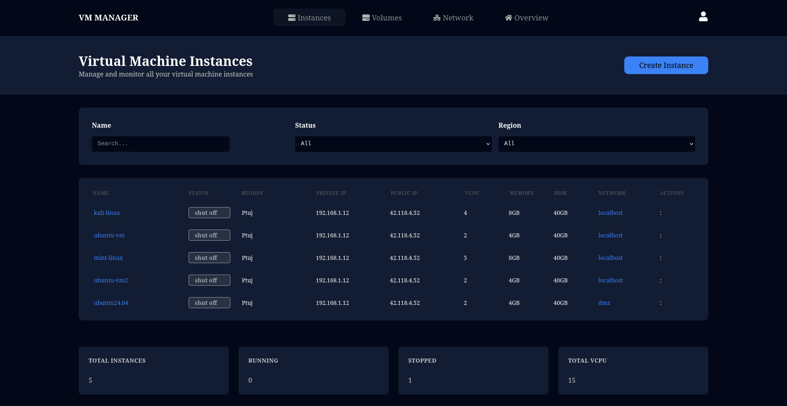
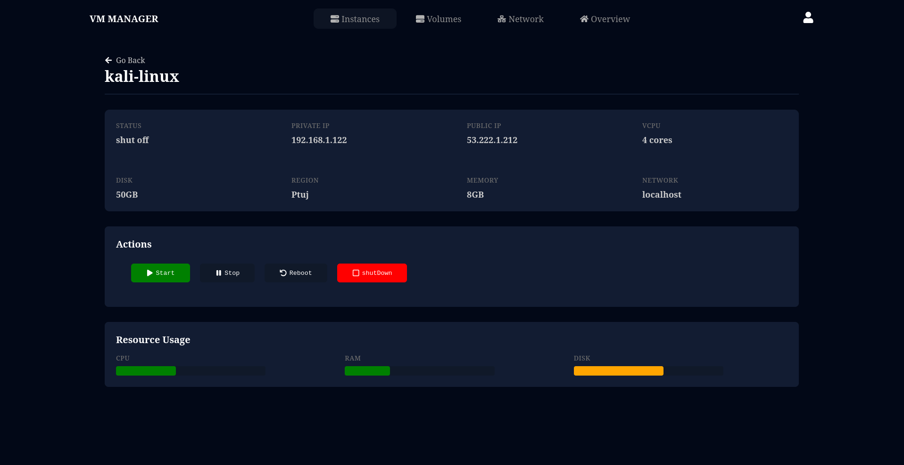

# VM Manager

## A simple virtual machine management system that helps you monitor and manage your virtual machines.
## Preview




## Prerequisites

1. Python 3.7+

2. npm

3. Libvirt

## Installation

```
git clone https://github.com/desolate-sorcerer/vm-manager.git

cd vm-manager

# build
./build.sh

# install
sudo dpkg -i vm-manager.deb
sudo apt install -f
```

## Run the application
```
# start
sudo systemctl start vm-manger
```
