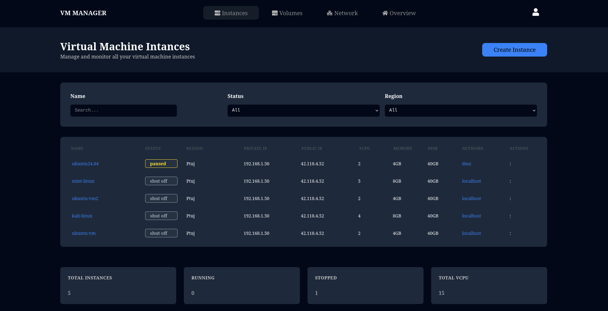

# VM Manager

## A simple virtual machine management system that helps you monitor and manage your virtual machines.
## Preview



## Prerequisites

1. Python 3.7+

2. npm

3. Libvirt

## Installation

```
git clone https://github.com/desolate-sorcerer/vm-manager.git

cd vm-manager

# bash script to install needed dependecis and packages
./install
```


```
```
## Run the application
```
# bash script to start
 ./start
```
